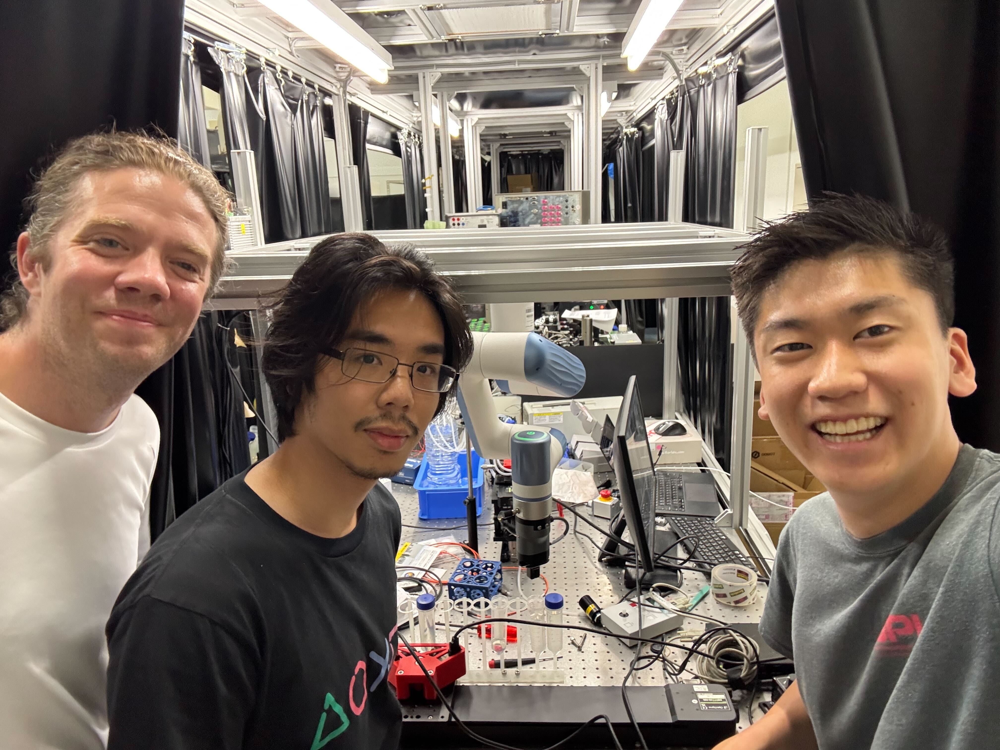

# Goda Lab Dobot Nova Control

Description: This repository contains code for automating fly handling using the Dobot Nova robotic arm.

The system is currently being developed at the **University of Tokyo’s Goda Lab (東京大学合田研究室)** by **Yunosuke Nakamura** (University of California, Berkeley) and **Joshua Dalijono** (University of Tokyo) under the supervision of **Professor Walker Peterson** (University of Tokyo).

